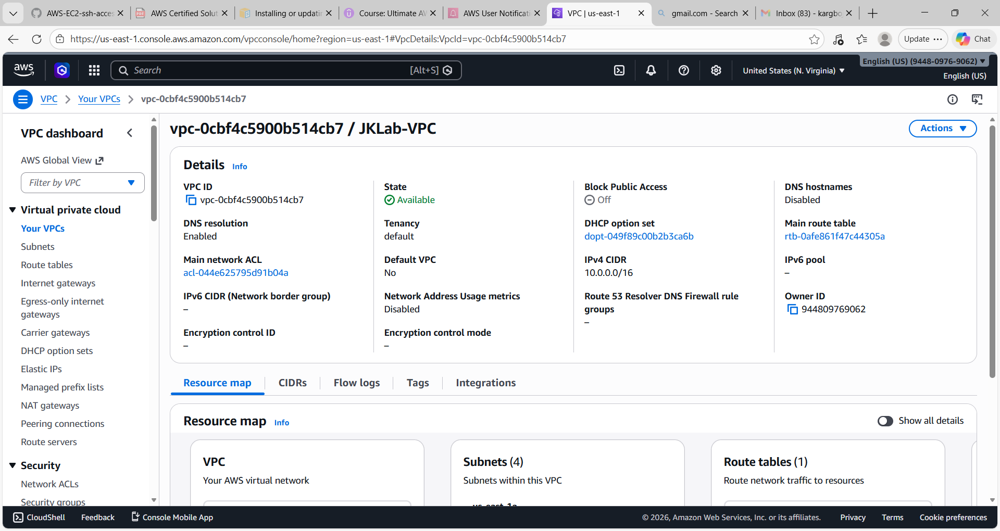
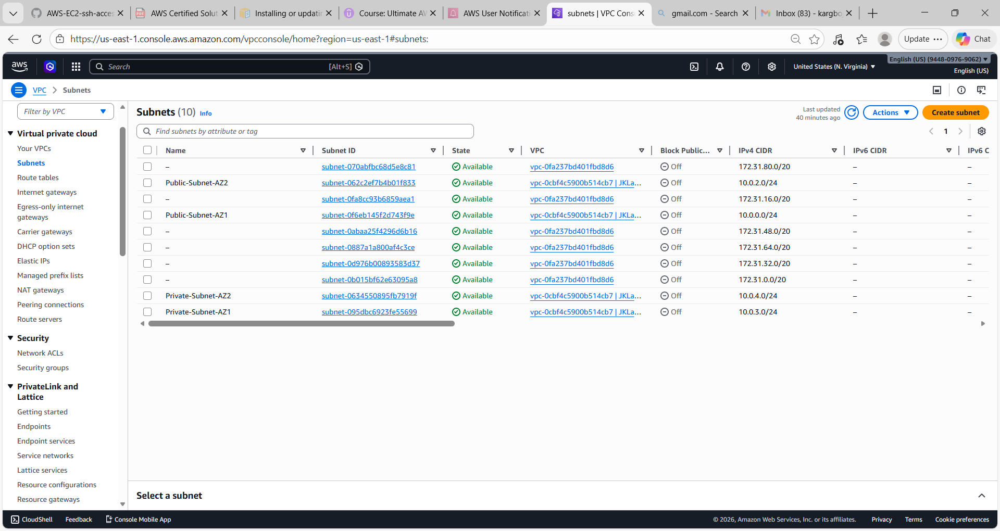
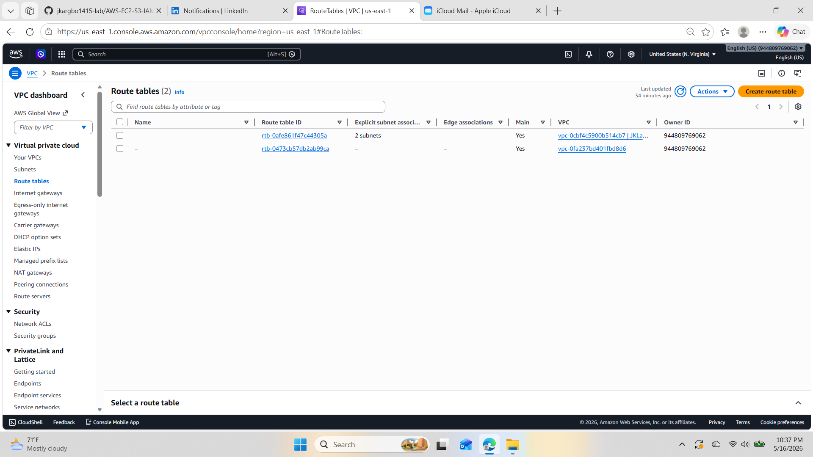
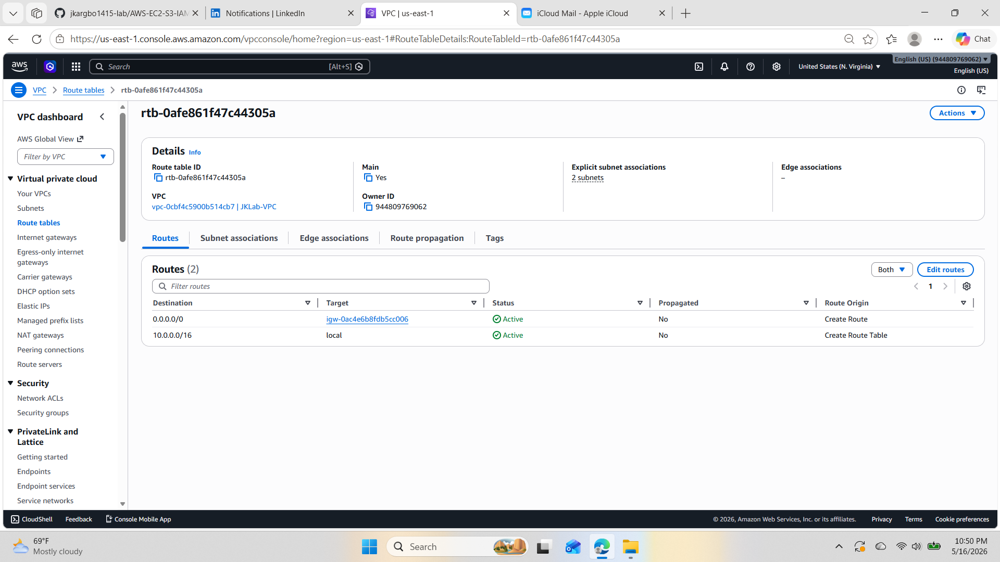
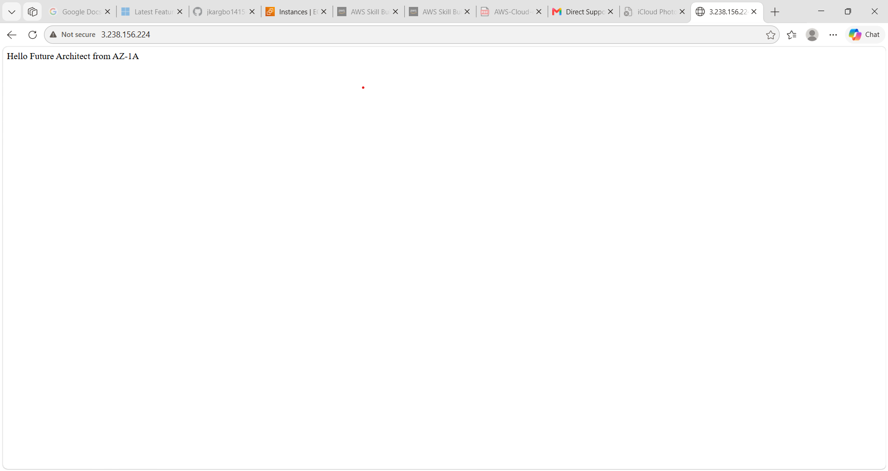
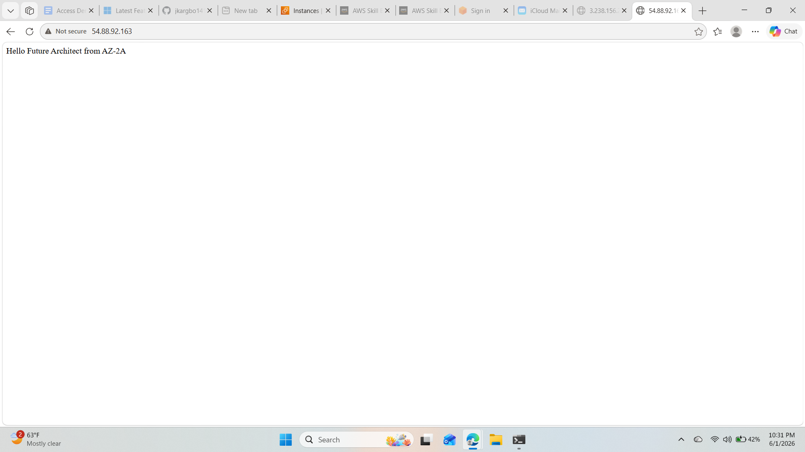
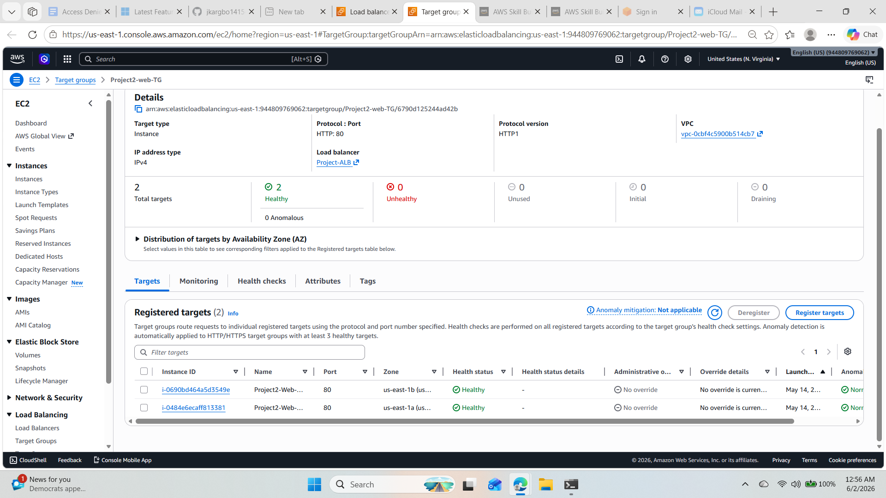
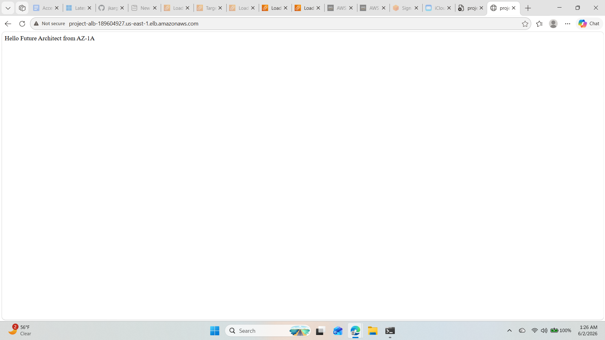

# AWS VPC High Availability Architecture
## Project Overview
This project demonstrates how to designand deploy a highly available web architecture on AWS using a custom VPC, public subnets across multiple Availability zones, EC2 web servers, an Application Load Balancers (ALB), and Target Groups
The architecture is designed to improve availability and fault tolerance by distributing web traffic across multiple EC2 instances located in seperate Availability zones.
## Architecture
This architecture consists of:
- one custom VPC
- Two public subnets across different Availability Zones
- An Internet Gateway attached to the VPC
- A route table associated with both public subnets
- Two EC2 instances running Apache Web Server
- One Target Group containing both EC2 instances
- One Application Load Balancer distributing traffic across both instances.
The Application Load Balancer routes incoming HTTP request to healthy EC2 instances in multiple Availability Zones, providing high availability and fault tolerance.
## AWS Services Used
- Amazon VPC
- Public Subnets
- Route Tables
- Internet Gateway
- Amazon EC2
- Apache Web Server
- Application Load Balancer (ALB)
- Target Groups
- Security Groups
## Implementation Steps
1. Created a custom VPC.
2. Created public subnets in two Availability Zones.
3. Attached an Internet Gateway.
4. Configured route table and subnets association.
5. Launched EC2 Web Servers in each Availability Zone.
6. Installed and configured Apache Web Server.
7. Created a Target Group.
8. Registered EC2 instances as targets
9. Created an Application Load Balancer.
10. Verified successful load balancing using the ALB DNS Name.
## Screenshots
### 01- VPC Created
Shows the custom VPC used to host the highly available architecture.

### 02-Internet Gateway Attached
Shows the Internet Gateway attached to the VPC to provide internet access.

### 03-Subnets Created
Shows the public subnets distributed across two Availability Zones.

### 04-Route Table Created
Shows the route table used for internet connectivity.

### 05-Route Table Routing and Association
Shows the route table associated with the public subnets and the route to the Internet Gateway.

### 06-Apache Web Server AZ1
Apache web server running in Availability Zone 1.

### 07-Apache Web Server AZ2
Apache web server running in Availability Zone 2.

### 08-Target Group Healthy
Both EC2 instances successfully registered and healthy in the target group

### 09-Application Load Balancer Test
Traffic Successfully reaches the application through the ALB DNS name.
.

## Key Learning Outcomes
- Understanding VPC architecture
- Understanding public and private subnet concepts
- Configuring Internet Gateway access
- Managing Route Tables and Subnets Associations
- Deploying EC2 instances accross multiple Availability Zones
- Configuring Application Load Balancer
- Understanding Target Groups and Health Checks
- Building highly available architectures on AWS

 ## AWS Solutions Architect Associate Concepts Covered
 - Highly Availability
 - Fault Tolerance
 - Load Balancing
 - VPC Designed
 - Networking Fundamentals
 - Security Groups
 - Route Tables
 - Internet Gateway
 - Target Groups
 - Multi-AZ Architecture

- 

